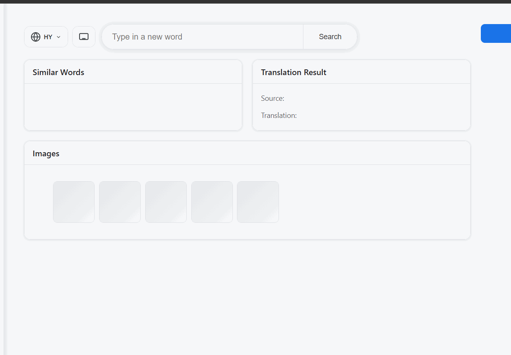

# Language learning application focused on Armenian language.

## Project goals:

An application that allows the gradual accumulation of vocabulary through various ways of interacting with words

## AI envolvment:
HTML + CSS - vibecoded; 
Backend (TS) - braincoded

## Current progress: 

### completed:
- input handling through typing and keyboard pop-up
- input language detection
- usage of tranlsation API (free version)
- validating a word through local dictionary
- suggested words generation through patterns (similar letters + dictionary validating)
- suggested words auto-translation through clicking
- image suggestions by English word (mocked)

### issues:
- possible to enter several words, not handled
- manually input word is not checked with dictionary before sending to API
- search cursor is not handled, every input goes to the line ending
- no checks for invalid input
- no checks for invalid translation
- no UI error handling

### todo:

- cards functionality
- authorization
- unit testing
- E2E testing Playwright
- local chosen images storing
- translation caching

# Demo

